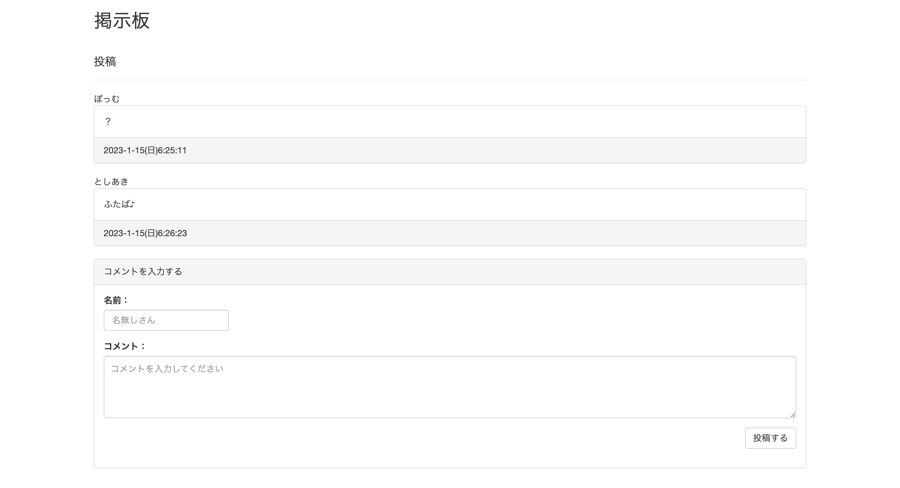

# bbs-powered-by-database

## Usage

    mysqlが必要です。mysqlのサーバーへ接続するための情報を、server.jsのconnectionに記述してください。
    別ファイルにしても良いのですが、server.js自体がapiサーバーも兼ねるものなので必要性は薄いと判断し一緒にしました。
    また、mysqlのデータベース生成のため、以下のコマンドを実行してください。ここでは利用するデータベース名をbbsとしています。
    ```sql
    create database bbs;
    use bbs;
    create table log (id int, name varchar(100), body varchar(10000), date varchar(100));
    exit;
    ```
    node server.js

## Screenshots


